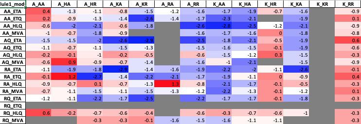

# Epistasis Calculator

The program epistasisCalc.py calculates the epistasis scores of combinatorial protein variants. See the book chapter  Structural Genomics from Springer Nature's Methods in Molecular Biology series on High-throughput Protein Engineering by Massively Parallel Combinatorial Mutagenesis for further references.

## Input
The input format is indicated as in epcalc_demo.csv. This program requires a csv input file and runs in Python 2.7.
The demo input is from https://www.nature.com/articles/s41592-019-0473-0 (G.C.G. Choi et al., Nat. Methods, 2019) and generates the heatmap equivalent to the sg5-on heatmap in Figure 4.
```
variant #,module 1,module 2,module 3,module 4,Bin A,unsorted,Bin A,unsorted
1,RQ,K,ETQ,KR,4450.26,1435.77,4284.28,1249.13
2,RA,K,ETQ,KR,1400.07,1847.80,3310.70,1641.19
3,AQ,K,ETQ,KR,642.39,983.92,1354.38,354.04
4,AA,K,ETQ,KR,1440.43,1566.68,2216.73,1880.55
5,RQ,A,ETQ,KR,2770.97,1896.66,1896.78,1762.74
6,RA,A,ETQ,KR,1662.72,1442.40,1682.18,1153.76
```

## Run
```
python epistasisCalc.py [input file] [line the first variant starts] [# of modules] [heatmap Dimension1] [heatmap Dimension2]
```
To run the demo file
```
python epistasisCalc.py epcalc_demo.csv 5 4 1,3 2,4
```

## Output
1. The program outputs a csv file showing the expected and observed log2 enrichment scores, and the epistasis score.
```
# variant,module0,module1,module2,module3,expected,observed,epistasis score
1,RQ,K,ETQ,KR,0.599970141774,0.599970141774,0.0
2,RA,K,ETQ,KR,0.686677888579,0.946801128994,0.260123240415
3,AQ,K,ETQ,KR,0.728668411362,1.11476322013,0.386094808765
4,AA,K,ETQ,KR,0.638929601079,0.755807978993,0.116878377914
5,RQ,A,ETQ,KR,0.713018218045,1.05216244686,0.339144228812
6,RA,A,ETQ,KR,0.79972596485,-0.167208855943,-0.966934820793
7,AQ,A,ETQ,KR,0.841716487633,0.87895350402,0.0372370163874
8,AA,A,ETQ,KR,0.751977677349,-0.812034285604,-1.56401196295
9,RQ,K,ETA,KR,0.724254637781,1.0971081258,0.372853488021
```
2. The program outputs a csv file, which is used as the input for heatmap generation. Column 1 contains the indicated modules in [heatmap Dimension1], and Column 2 contains the indicated modules in [heatmap Dimension2].
```
module0_module2,module1_module3,epistasis score
RQ_ETQ,K_KR,0.0
RA_ETQ,K_KR,0.260123240415
AQ_ETQ,K_KR,0.386094808765
AA_ETQ,K_KR,0.116878377914
RQ_ETQ,A_KR,0.339144228812
RA_ETQ,A_KR,-0.966934820793
AQ_ETQ,A_KR,0.0372370163874
AA_ETQ,A_KR,-1.56401196295
RQ_ETA,K_KR,0.372853488021
```
3. The heatmap (an Excel matrix) of the calcuated epistasis scores for each combination.


## Note
csv files can be opened using excel or other spreadsheet softwares.

## License
[MIT](https://choosealicense.com/licenses/mit/)
